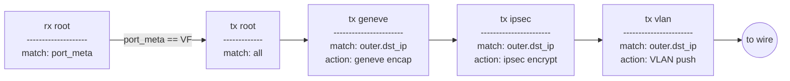
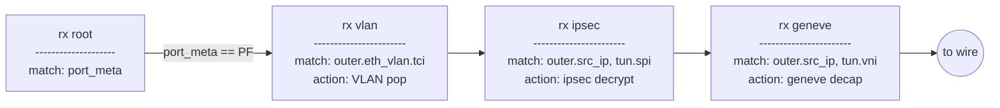

# DOCA cloud

### Prereqs
```sh
# DOCA and DPDK must be installed
pkg-config --modversion doca-flow doca-common doca-dpdk-bridge libdpdk
# yaml-cpp used to parse input
sudo apt-get install libyaml-cpp-dev
```

### Build
```sh
# Following packages must be in PKG_CONFIG_PATH:
#   doca-flow, doca-common, doca-dpdk-bridge, libdpdk, yaml-cpp
meson build
ninja -C build
```

### Run
```sh
build/doca-cloud app_cfg.yml
```

## Pipeline

### Egress datapath


### Ingress datapath


### TODO
1. ARP responder
2. IPSEC syndrome pipes
