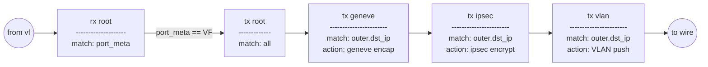
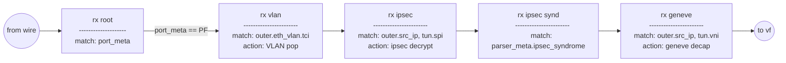
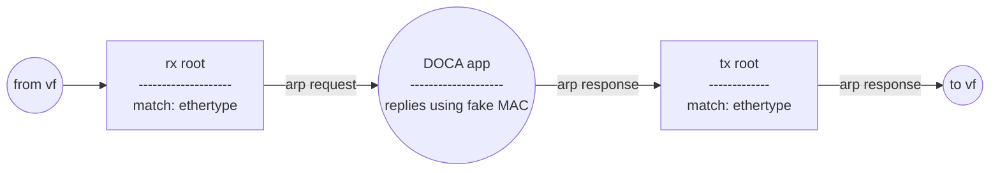

# DOCA cloud

### Prereqs
```sh
# DOCA and DPDK must be installed, verify with
pkg-config --modversion doca-common doca-flow doca-dpdk-bridge libdpdk

# yaml-cpp used to parse input, install it work
sudo apt-get install libyaml-cpp-dev
```

### Build
```sh
meson build
ninja -C build
```

### Run
```sh
build/doca-cloud app_cfg.yml
```

## Pipeline

### Egress datapath


### Ingress datapath


### ARP responder datapath

